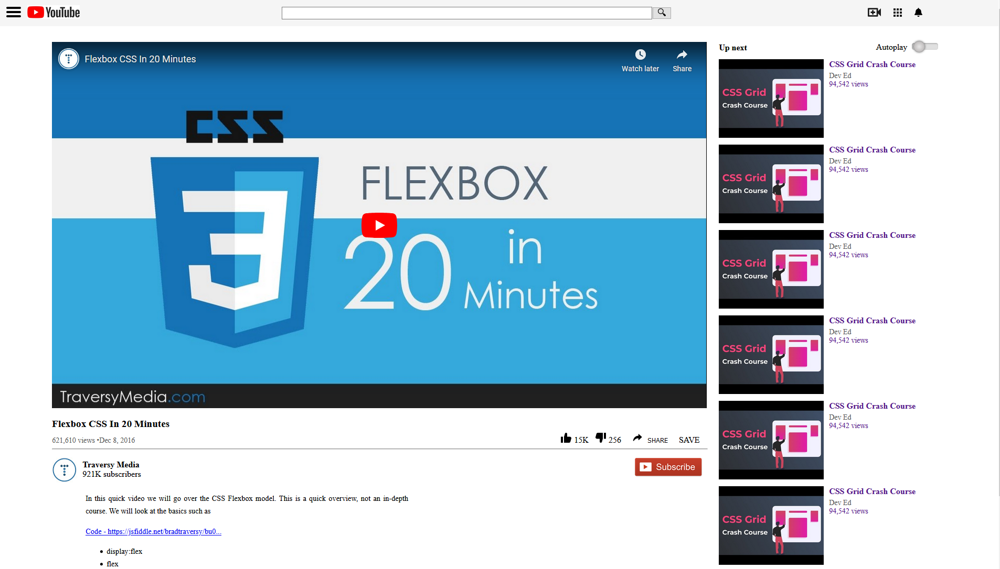

# Youtube-clone
I built a webpage that matches the appearance of the original Youtube.com video player page.  My first Microverse assignment.

This project consists of replicating the Youtube.com webpage puting emphasis on embedding images and video.

## Built With

- HTML 5
- CSS 3

## Live Demo

[Live Demo Link](https://meltrust.github.io/Youtube-clone/)

## Getting Started

**To get a local copy up and running follow these simple example steps.**

- Clone the project unto your local machine
- Navigate into `index.html` file and run on the browser

## Authors

👤 **Miguel Tapia**

- Linkedin: [meltrust](https://www.linkedin.com/in/meltrust/)

## 🤝 Contributing

Contributions, issues and feature requests are welcome!

Feel free to check the [issues page](issues/).

## Show your support

Give a ⭐️ if you like this project!

## Acknowledgments

- Hat tip to anyone whose code was used
- Inspiration
- etc

## 📝 License

This project is [MIT](lic.url) licensed.
